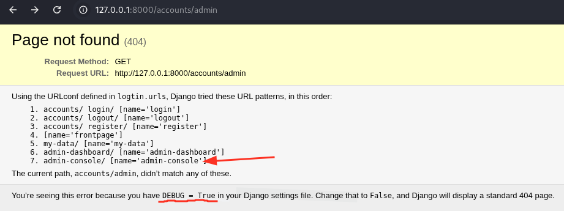
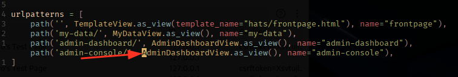
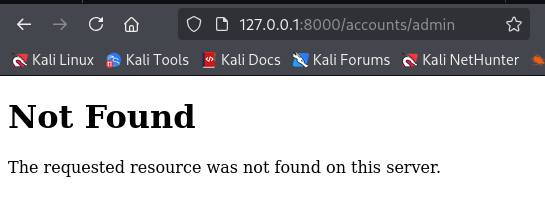

# H2
Tehtävänanto: Tero Karvinen, Lari Iso-Anttila, https://terokarvinen.com/sovellusten-hakkerointi/

***
> x)

1) [OWASP Top 10:2021 A01 Broken Access Control](https://owasp.org/Top10/A01_2021-Broken_Access_Control/)
    * Broken access control on ollut vuoden 2021 yleisin haavoittuvuus. 318k tapahtumia.
---
2) [Karvinen 2023](https://terokarvinen.com/2023/fuzz-urls-find-hidden-directories/)
    * Karvinen opettaa kuinka fuzzeria käytetään, fuzzereilla esim. voi nopeuttaa raakaa
    weppisivujen kansioiden etsintää.

---
3) [PortSwigger: Access control vulnerabilities and privilege escalation](https://portswigger.net/web-security/access-control)
    * Samaa juttua kuin edellä oleva OWASP. PortSwigger tarjoaa myös suoraan labroja
    näiden harjoitteluihin!

---
4) [Karvinen 2006: Raportin kirjoittaminen](https://terokarvinen.com/2006/raportin-kirjoittaminen-4/)
    * Hyvä raportti: toistettava, täsmällinen, helppolukuinen, viittaa lähteisiin.
    * Sepittämistä tulee välttää, liian raskasta luettavaa.

---
## Tehtävät a, b)

Klassinen SQL injektio tapaus. Tässä on lisänä vielä Teron fiksu front-end, joka
estää suoraan muun kuin numeroiden laittamisen syötteeseen. Tähän siis tarvitaan
työkalu, jolla voidaan muuttaa suoraan palvelimelle lähtevää pyyntöä, esim. `burpsuite`.

Burpissa avataan ensin selain, mennään kohdeosoitteeseen ja laitetaan Proxy-välilehdeltä
intercept päälle. Sen jälkeen voidaan muuntaa pyyntöä aina kun painetaan sivulta
nappia "Reveal my password".


Tykkään tälläisissä lähettää pyynnön Repeaterille, jossa voi lähettää samaa
pyyntöä helposti useamminkin, aina vaihtamalla jotain pyynnössä. Onnistuu oikealla
hiiren painikkeella pyyntöön intercept välilehdellä.


1) Korjaa pyynnön otsake haluamalla tavalla
2) Paina "Send"
3) Tarkkaile vastausta
4) Kirjoita mielenkiintoiset ylös muistiinpanoihin.


```
pin=' OR True ;--
<p>Your password is <b>foo</b></p>

pin=' OR True  LIMIT 1 OFFSET 1;--
<p>Your password is <b>Somedude</b></p>

pin=' OR True  LIMIT 1 OFFSET 2;--
<p>Your password is <b>SUPERADMIN%%rootALL-FLAG{Tero-e45f8764675e4463db969473b6d0fcdd}</b></p>
```


Huomasin vasta jälkeenpäin, että olisi voinut käyttää esim `LIMIT 0,1`, `LIMIT 1,1`,
ja `LIMIT 2,1` osoittamaan samat kuin yllä. Muistin, että jotenkin näin se menee
joten etsin hakusanoilla `OFFSET` [PayloadsAllTheThings](https://github.com/swisskyrepo/PayloadsAllTheThings/blob/master/SQL%20Injection/README.md#no-comma-allowed)
nimisestä reposta.

Korjataan SQLi.

Googlataan, miten pythonilla tämä tulisi tehdä.

```python
# Source: https://blog.devgenius.io/til-python-sqlite3-using-placeholders-to-bind-values-in-sql-statement-62d10338cb6b
# Never do this -- insecure!
symbol = 'RHAT'
cur.execute("SELECT * FROM stocks WHERE symbol = '%s'" % symbol)

# This is the qmark style:
cur.execute("insert into lang values (?, ?)", ("C", 1972))

# And this is the named style:
cur.execute("select * from lang where date=:year", {"year": 1972})
```

Mennään näillä eväillä korjailemaan.

Alla olen ottanut koodista palan ja kommentoinut hieman. Tärkeimmät osat tässä on
nyt `res`-muuttujat. Yksi niistä on kuten oli, toinen niistä on korjattu. `sql`-
muuttuja on se, jonka takia injektio tapahtuu. Sen olen jättänyt rauhaan, koska
kuitenkin weppisivulla näytetään millaisen komennon palvelin on syönyt, joka on
hyödyllistä tietoa.

```python
# Tämä on ihan ok, voisi olla paremminkin:
if "pin" in request.form:
    pin = str(request.form['pin'])
else:
    pin = "0"

# Ei näin, mutta olkoot, koska käytetään enää näyttämään koko pyyntö weppisivulla tekstimuodossa:
sql = "SELECT password FROM pins WHERE pin='"+pin+"';"

# Rikkinäinen res -> SQL injektio
res=db.session.execute(text(sql))

# Korjattu res -> Ei SQL injektioita
res=db.session.execute(text("SELECT password FROM pins WHERE pin= :pin;"),{"pin": pin})
```

Eli mitään muuta en muuttanut, kuin tuon `res`-muuttujan. Kaikki muu on täysin sama.

Kokeillaan samat injektiot uudelleen:


Eipä toimi!


Eipä toimi!

***
## Tehtävä c)

Tämän olen suorittanut jo, selostus löytyy [täältä](https://github.com/p-lemonish/course-penetration-testing/blob/master/h3.md)

***
## Tehtävät d, e)

Tämähän on fuzzattavissa, mutta löysin helpomman keinon. Kehittäjältä jäänyt `DEBUG`
lippu päälle tuotantoon.



Käytäessä esitetyllä sivulla:


Käydään korjaamassa koodia siten, että laitetaan ensinnäkin `DEBUG = False`
ja sitten evätään pääsy sivulle ilman admin-tunnuksia, jottei fuzzerillakaan
olisi päässyt sivulle vaikka sen löytäisikin.

Ensinnäkin etsitään missä `DEBUG`-lippu asetetaan:

```bash
$ pwd
/home/kali/apphacking/2/challenges/020-your-eyes-only/logtin

$ grep -H "DEBUG" */*.py
logtin/settings.py:DEBUG = True
```

Korjataan True -> False, huom. security warning joka jäänyt joltain lukematta.:


Seuraavaksi etsitään löytyisikö helpolla koodit, joissa määritetään nuo admin-reitit.

```bash
$ grep -H "admin-" */*.py
hats/urls.py:   path('admin-dashboard/', AdminDashboardView.as_view(), name="admin-dashboard"),
hats/urls.py:   path('admin-console/', AdminShowAllView.as_view(), name="admin-console"),
hats/views.py:  template_name="hats/admin-show-all.html"
hats/views.py:  template_name="hats/admin-show-all.html"
```

Löytyy ne ja näen ainakin itse vielä lisksi, että näillä kahdella urlilla on erilaiset
asetukset; `AdminDashboardView` ja `AdminShowAllView`. Tarkastellaan koodista vielä.


Tämä kuva ei hirveästi kerro mitään, käydään vielä näiden määritelmässä:


Nyt löytyykin syyllinen. `AdminShowAllView` ei vaadi käyttäjän olevan `staff`.
Tämän voisi olettaa olevan virhe, ehkä vahingossa tabia painellessa on koodari
laittanut väärän asetuksen tälle urlille. Korjataan urlin asetukseksi `AdminDashboardView`.



Korjattu, palvelinta pystyyn


Herja tulee, kun debug on false. Lisätään vielä `ALLOWED_HOSTS = localhost`


Nyt ajetaan palvelin taas pystyyn ja tarkastetaan, tuleeko 404 sen sijaan, että
näkyy reitit kaikille.



Ja antaako admin-console 403.


***

# Lähteet
1) Tero Karvinen, Sovellusten hakkerointi, 2025, https://terokarvinen.com/sovellusten-hakkerointi/
2) swisskyrepo, PayloadsAllTheThings, https://github.com/swisskyrepo/PayloadsAllTheThings/blob/master/SQL%20Injection/README.md#no-comma-allowed
3) TIL: Python sqlite3 — using placeholders to bind values in SQL statements, Tom Deneire, 2022, https://blog.devgenius.io/til-python-sqlite3-using-placeholders-to-bind-values-in-sql-statement-62d10338cb6b
4) Patrik Mihelson-Adamson, H3 - Tunkeutumistestaus, 2025, https://github.com/p-lemonish/course-penetration-testing/blob/master/h3.md
