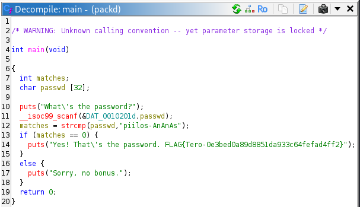
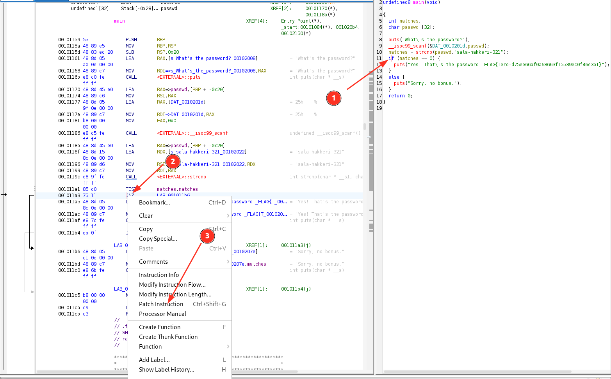
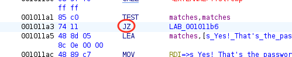
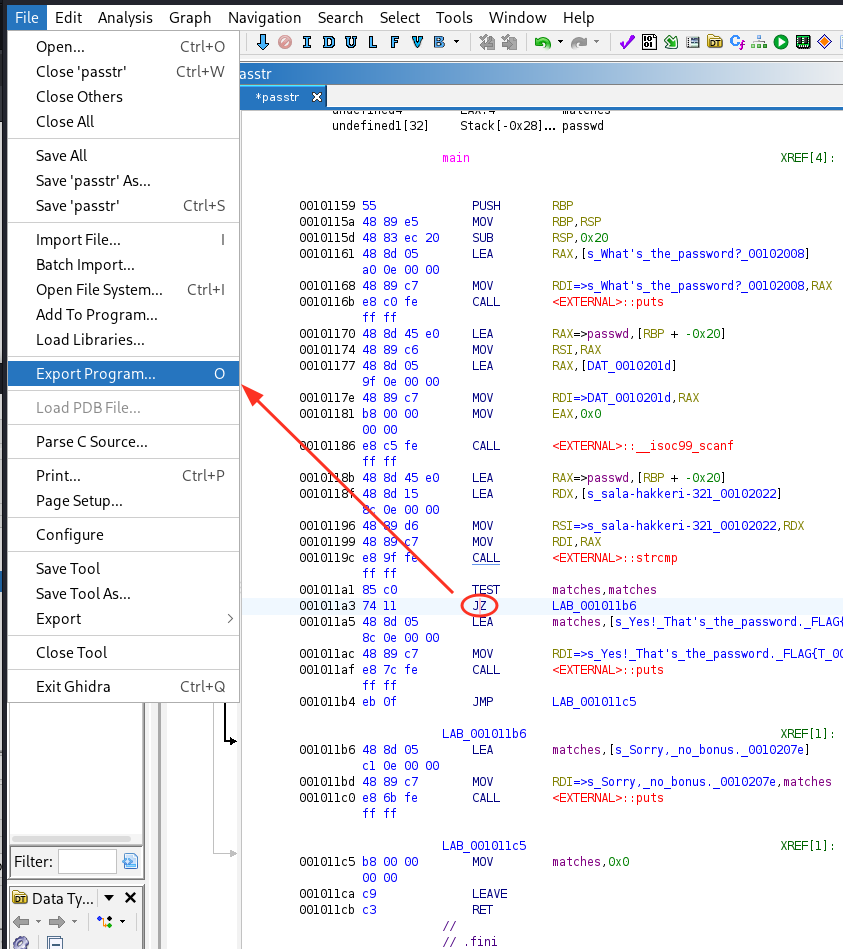
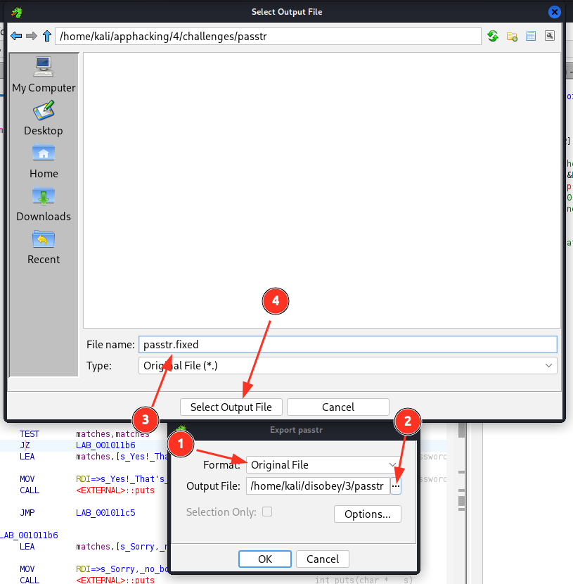

# H4
Tehtävänanto: Tero Karvinen, Lari Iso-Anttila, https://terokarvinen.com/sovellusten-hakkerointi/

***
## Tehtävä x
> x) Lue/katso/kuuntele ja tiivistä.

Hammond videollaan esittelee oman läpikävelynsä PicoCTF:än tehtävään `bbbloat`.
Video on hyödyllinen, koska siinä nähdään kuinka käytännössä Ghidraa voidaan käyttää!

***
## Tehtävä a
> a) Asenna Ghidra

Tämä tehtiin jo tunnilla. Itselleni kalilla komennolla `sudo apt install ghidra`.

***
## Tehtävä b
> b) rever-C. Käänteismallinna packd-binääri C-kielelle Ghidralla. Etsi pääohjelma. Anna muuttujielle kuvaavat nimet. Selitä ohjelman toiminta. Ratkaise tehtävä binääristä, ilman alkuperäistä lähdekoodia. ezbin-challenges.zip

Edellisen viikon avuilla unpackataan `packd`-tiedosto, sitten viedään Ghidraan.



Minulla ainakin Ghidra vie suoraan `main` funktion kohdalle. Ja siellä salasana
odottelee jo lukijaansa. Tuon voi syöttää suoraan binäärille ja pääsee läpi.

```bash
$ ./packd
What's the password?
piilos-AnAnAs
Yes! That's the password. FLAG{Tero-0e3bed0a89d8851da933c64fefad4ff2}
```


***
## Tehtävä c
> c) Jos väärinpäin. Muokkaa passtr-ohjelman binääriä (ilman alkuperäistä lähdekoodia) niin, että se hyväksyy kaikki salasanat paitsi oikean. Osoita testein, että ohjelma toimii. ezbin-challenges.zip

Avataan Ghidralla `passtr`, painetaan auto-analyze, minut taas heitettiin suoraan mainiin.

Nyt seurataan kuvien mukaan:

Hiirellä painellen `if`:stä löytää assembly-ohjeen `JNZ`. Patchataan.





Vaihdettu `JNZ -> JZ`





Ja terminaalissa sitten
```bash
$ ls
Makefile  passtr  passtr.c  passtr.fixed  README.md

$ chmod +x passtr.fixed

$ ./passtr.fixed
What's the password?
helloworld
Yes! That's the password. FLAG{Tero-d75ee66af0a68663f15539ec0f46e3b1}
```

***
## Tehtävä d
> d) Nora crackme01(e). Ratkaise binääri.

`crackme` gitin kloonaus:

```bash
$ git clone https://github.com/NoraCodes/crackmes.git
Cloning into 'crackmes'...
remote: Enumerating objects: 72, done.
remote: Counting objects: 100% (3/3), done.
remote: Compressing objects: 100% (3/3), done.
remote: Total 72 (delta 0), reused 1 (delta 0), pack-reused 69 (from 1)
Receiving objects: 100% (72/72), 16.15 KiB | 424.00 KiB/s, done.
Resolving deltas: 100% (36/36), done.
```
Mennään kansioon, README.md sanoi, että `make`.
```bash
$ cd crackmes

$ ls
crackme01.c  crackme01e.c  crackme02.c  crackme02e.c  crackme03.c  crackme03e.c ...

$ make
gcc -O1 -fno-stack-protector -lcrypt -m64 crackme01.c -o crackme01.64
objcopy -g crackme01.64
...
gcc -O1 -fno-stack-protector -lcrypt -m64 crackme09.c -o crackme09.64
objcopy -g crackme09.64

$ ls
crackme01.64  crackme01e.64  crackme02.64  crackme02e.64  crackme03.64  crackme03e.64  ...
crackme01.c   crackme01e.c   crackme02.c   crackme02e.c   crackme03.c   crackme03e.c   ...
```

Kaikki binäärit paikallaan, ajetaan ensimmäinen haaste

```bash
$ ./crackme01.64
Need exactly one argument.

$ ./crackme01.64 hello
No, hello is not correct.
```

Tutkitaan strings

```bash
$ strings crackme01.64 | less

...
u+UH
Need exactly one argument.
password1
No, %s is not correct.
Yes, %s is correct!
...
```

Kokeillaan löytynyt salis

```bash
$ ./crackme01.64 password1
Yes, password1 is correct!
```

Kokeillaan sitten seuraavaa

```bash
$ ./crackme01e.64
Need exactly one argument.


$ ./crackme01e.64 password1
No, password1 is not correct.


u+UH
Need exactly one argument.
slm!paas.k
No, %s is not correct.
Yes, %s is correct!
;*3$"
```

Kokeillaan josko voisi kirjaimellisesti laittaa tuo näytetty..

```bash
$ ./crackme01e.64 'slm!paas.k'
Yes, slm!paas.k is correct!
```

***
## Tehtävä f
> f) Nora crackme02. Ratkaise binääri.

Avataan Ghidrassa, etsitään `main`, ja kirjoitellaan muutamat muuttujat, jotta
koodi käy enemmän järkeen.

```c
int main(int numArgs,char *givenPasswd)

{
  char expectedNext;
  int success;
  long index;

  if (numArgs == 2) {
    expectedNext = 'p';
    index = 0;
    do {
      if (*(char *)(*(long *)(givenPasswd + 8) + index) == '\0') break;

      // Tämä alla oleva on se kiinnostava.
      // expectedNext on aina password1:stä yksi kirjain, josta poistetaan 1
      // ja sitten verrataan vastaavaan annetun salasanan kirjaimeen
      if (expectedNext + -1 != (int)*(char *)(*(long *)(givenPasswd + 8) + index)) {
        printf("No, %s is not correct.\n");
        return 1;
      }
      expectedNext = "password1"[index + 1];
      index = index + 1;
    } while (expectedNext != '\0'); // <-- tämä on mielenkiintoinen, ks. alla selitys
    printf("Yes, %s is correct!\n");
    success = 0;
  }
  else {
    puts("Need exactly one argument.");
    success = -1;
  }
  return success;
}
```

Selitin mielenkiintoisen osan suoraan koodiin yllä.

Näyttää siltä, että salasana tarkastetaan niin, että otetaan aina kirjaimesta
edellinen heksadesimaaliarvo. Kokeillaan, mitä "password1" olisi näin. Pythonilla:

```python
>>> ord('p')
112
>>> ord('p')-1
111
>>> chr(ord('p')-1)
'o'
>>> chr(ord('a')-1)
'`'
>>> chr(ord('s')-1)
'r'
>>> chr(ord('w')-1)
'v'
>>> chr(ord('o')-1)
'n'
>>> chr(ord('r')-1)
'q'
>>> chr(ord('d')-1)
'c'
>>> chr(ord('1')-1)
'0'
>>> eli password1 -> o`rrvnqc0
```

```bash
$ ./crackme02.64 'o`rrvnqc0'
Yes, o`rrvnqc0 is correct!
```

PS. tämän voi myös ratkoa antamalla tyhjän argumentin :D

```bash
$ ./crackme02.64 ''
Yes,  is correct!
```

# Lähteet
1. Tero Karvinen, Sovellusten hakkerointi, https://terokarvinen.com/sovellusten-hakkerointi/
2. John Hammond, GHIDRA for Reverse Engineering (PicoCTF 2022 #42 'bbbloat'), https://www.youtube.com/watch?v=oTD_ki86c9I
3. Leonora Tindall (NoraCodes), crackmes, https://github.com/NoraCodes/crackmes/tree/master


