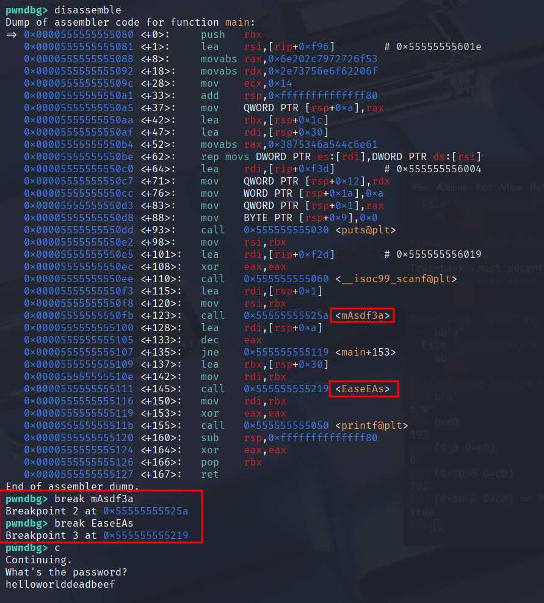

# H5
Tehtävänanto[^2]

## Lab 0
Käynnistetään ohjelma gdbllä ja asetetaan breakpoint `main`, sen jälkeen `r`.
```bash
$ gdb buggy_program
pwndbg> break main
Breakpoint 1 at 0x1198: file buggy_program.c, line 10.

pwndbg> r
Starting program: /home/kali/apphacking/5/lab0/buggy_program
...
Breakpoint 1, main () at buggy_program.c:10
```


sitten `si`, päästään funktion sisään. Nyt `disassemble`


```bash
pwndbg> break printf
Breakpoint 2 at 0x7ffff7e04900: file ./stdio-common/printf.c, line 28.

pwndbg> display /bx ($rbp-0x4)
1: x/xb ($rbp-0x4)  0x7fffffffdb9c:     0xff
```

i ei ole vielä tähän alustettu, niin näyttää 0xff, ihan OK. painetaan c(ontinue).

```bash
pwndbg> c
Continuing.
Breakpoint 2, __printf (format=0x555555556004 "Element %d: %d\n") at ./stdio-common/printf.c:28
1: x/xb ($rbp-0x4)  0x7fffffffdb6c:     0x00

pwndbg>
Continuing.
Element 0: 1
Breakpoint 2, __printf (format=0x555555556004 "Element %d: %d\n") at ./stdio-common/printf.c:28
1: x/xb ($rbp-0x4)  0x7fffffffdb6c:     0x01

pwndbg>
Continuing.
Element 1: 2
Breakpoint 2, __printf (format=0x555555556004 "Element %d: %d\n") at ./stdio-common/printf.c:28
1: x/xb ($rbp-0x4)  0x7fffffffdb6c:     0x02

pwndbg>
Continuing.
Element 2: 3
Breakpoint 2, __printf (format=0x555555556004 "Element %d: %d\n") at ./stdio-common/printf.c:28
1: x/xb ($rbp-0x4)  0x7fffffffdb6c:     0x03

pwndbg>
Continuing.
Element 3: 4
Breakpoint 2, __printf (format=0x555555556004 "Element %d: %d\n") at ./stdio-common/printf.c:28
1: x/xb ($rbp-0x4)  0x7fffffffdb6c:     0x04

pwndbg> fin
Run till exit ...
Element 4: 5
buggy_function (arr=0x7fffffffdb80, size=5) at buggy_program.c:4
1: x/xb ($rbp-0x4)  0x7fffffffdb6c:     0x04


```


tämä menee vielä yhdelle kierrokselle vaikka kaikki numerot 1-5 on jo printattu. Aiheuttaa ylivuodon.

## Lab 1

Samat temput kuin edellä,

```
> break main
> c
```

saadaan näkymä:


`printf_scrambled` kiinnostaa, `ni` sinne asti ja sitten `si`.


Tämä disassembly kertoo jo riittävästi, jos sitä lukee suoraan pwndbg:llä karkeasti:

1) Haetaan ensimmäinen kirjain saatavilla olevasta stringistä 'H' = 0x48
2) Lisätään siihen 3 jolloin siitä tulee 0x4b = 'K'

Eli tässä siis otetaan kirjain, ja lisätään siihen 3. Piilotetaan tekstiä. Ulos tulee
ekana
```
Khoor/#zruog1\n
```

Entäs sitten..

```
Program received signal SIGSEGV, Segmentation fault.
```


Näyttäisi siltä, että koitetaan ottaa arvoa nollaosoitteesta, eli asiasta jota ei ole.
Siksi tuo seg fault tulee myös.

## Lab 2


Tässähän jo näkyisi pwndbg:llä haluttu salasana, mutta rikotaan tällä kertaa
menemällä testin yli


Kuvassa näkyy että jne jälkeen tulisi "Sorry, no bonus".

Tarkastellaan "instruction pointeria" eli rip. jos viedään pc neljän verran eteenpäin,
niin ollaan kuten ei oltaisi epäonnistuttu testissä


Ja niimpä näkyykin.

## Lab 2 v2


disassemblella näkyy pari oudon nimistä funktiota. Laitetaan breakpoint näihin.


Taidettiin ehkä failata, alotetaan alusta ja katsotaan ghidralla..


Huomataan pari juttua:
- `mAsdf3a` -> `passwdChecker`
- `EaseEAs` -> `unscramble`
1) päädytään hankalaan for-looppiin, jota on vaikea hallita
2) parempi skipata koko juttu


eli `mustBe1` olen merkinnyt `passwdChecker`in palautusarvoksi, jonka nimensä mukaan
täytyy olla 1. Muuten seuraavaa iffiä ei päästä läpi. Toisin sanoin ei tarkasteta
`mustBe1` ollenkaan. Poistetaan koko if.

Gdbssä: yhdellä continuella ja salasanan annolla päästään passwdCheckeriin. `fin`
kirjoittamalla hypätään sieltä pois, sen tulos on nyt ihan sama.


ollaan mainissa juuri ennen tärkeää iffiä


tarkastellaan taas instruction pointerilla, nyt `jne` tavut kiinnostavat. Katsotaan
manuaalista[^1], josta selviää että `JNE` -> `NOP NOP` jos muutetaan nuo `75 10`
tavut `90 90`.


Tarkastetaan ensimmäisen muutoksen jälkeen, ihan huvikseen.


Muutetaan vielä `10` -> `90`. Sen jälkeen `c`.

Breakattiin `unscramble` funktion sisään, voidaan ihan huvikseen katsoa miltä
tämä näyttää asmilla..


:D ihan hyvä tarkastella Ghidralla mielummin tätä. Ajetaan ulos tästä `fin`.


Näkyykin jo rekistereissä, että ulos on tulossa lippu.


Jatketaan `c`.


# Lähteet
[^1]: X86 Opcode and Instruction Reference Home, http://ref.x86asm.net/coder32.html
[^2]: Moodle, Sovellusten hakkerointi kotisivut, Larin osio
