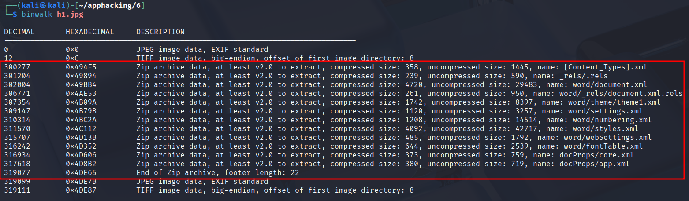

# H6
Tehtävänanto[^2]

## Lab 0 ja 1

Ajetaan `binwalk`:



Huomataan piilossa oleva zip, kokeillaan `binwalk -eM`

```bash
$ binwalk -eM h1.jpg

Scan Time:     2025-09-28 14:40:53
Target File:   /home/kali/apphacking/6/h1.jpg
MD5 Checksum:  ac7625e3c7c9e6be34987985a07d8a30
Signatures:    436

DECIMAL       HEXADECIMAL     DESCRIPTION
--------------------------------------------------------------------------------
300277        0x494F5         Zip archive data, at least ...
301204        0x49894         Zip archive data, at least ...
302004        0x49BB4         Zip archive data, at least ...
306771        0x4AE53         Zip archive data, at least ...
307354        0x4B09A         Zip archive data, at least ...
309147        0x4B79B         Zip archive data, at least ...
310314        0x4BC2A         Zip archive data, at least ...
311570        0x4C112         Zip archive data, at least ...
315707        0x4D13B         Zip archive data, at least ...
316242        0x4D352         Zip archive data, at least ...
316934        0x4D606         Zip archive data, at least ...
317618        0x4D8B2         Zip archive data, at least ...

WARNING: One or more files failed to extract: either no utility was found or it's unimplemented
```

tarkastetaan:
```bash
$ cd _h1.jpg.extracted

$ ls
494F5.zip

$ file 494F5.zip
494F5.zip: Microsoft Word 2007+

$ unzip -l 494F5.zip
Archive:  494F5.zip
  End-of-central-directory signature not found.  Either this file is not
  a zipfile, or it constitutes one disk of a multi-part archive.  In the
  latter case the central directory and zipfile comment will be found on
  the last disk(s) of this archive.
unzip:  cannot find zipfile directory in one of 494F5.zip or
        494F5.zip.zip, and cannot find 494F5.zip.ZIP, period.
```

unzippaus suoraan ei onnistu eli zipin irrottaminen tuota h1.jpg:tä epäonnistui
osittain, binwalkilla katsotaan taas

```bash
$ binwalk 494F5.zip

DECIMAL       HEXADECIMAL     DESCRIPTION
--------------------------------------------------------------------------------
0             0x0             Zip archive data, at least ...
927           0x39F           Zip archive data, at least ...
1727          0x6BF           Zip archive data, at least ...
6494          0x195E          Zip archive data, at least ...
7077          0x1BA5          Zip archive data, at least ...
8870          0x22A6          Zip archive data, at least ...
10037         0x2735          Zip archive data, at least ...
11293         0x2C1D          Zip archive data, at least ...
15430         0x3C46          Zip archive data, at least ...
15965         0x3E5D          Zip archive data, at least ...
16657         0x4111          Zip archive data, at least ...
17341         0x43BD          Zip archive data, at least ...
18800         0x4970          End of Zip archive, footer length: 22
18822         0x4986          JPEG image data, EXIF standard
18834         0x4992          TIFF image data, big-endian, offset of first image directory: 8
```

Eli lopussa on vielä roinaa.. Poistetaan se, kaiverretaan tästä zipistä vähän pienempi.
Selostan vielä seuraavassa koodilaatikossa mitä kaikki `dd` komennon argumentit ovat.[^3]

```bash
$ dd if=494F5.zip of=494F5-carve.zip bs=1 count=18822 status=progress

# if=494F5.zip -> input file
# of=494F5-carve.zip -> output file
# bs=BYTES; read and write up to BYTES bytes at a time (default: 512); overrides ibs and obs
# count=18822 -> minne asti (ks edellinen binwalk milloin zip archive loppuu)

18822+0 records in
18822+0 records out
18822 bytes (19 kB, 18 KiB) copied, 0.0207276 s, 908 kB/s

$ ls
494F5-carve.zip  494F5.zip

$ binwalk 494F5-carve.zip

DECIMAL       HEXADECIMAL     DESCRIPTION
--------------------------------------------------------------------------------
0             0x0             Zip archive data, at least ...
927           0x39F           Zip archive data, at least ...
1727          0x6BF           Zip archive data, at least ...
6494          0x195E          Zip archive data, at least ...
7077          0x1BA5          Zip archive data, at least ...
8870          0x22A6          Zip archive data, at least ...
10037         0x2735          Zip archive data, at least ...
11293         0x2C1D          Zip archive data, at least ...
15430         0x3C46          Zip archive data, at least ...
15965         0x3E5D          Zip archive data, at least ...
16657         0x4111          Zip archive data, at least ...
17341         0x43BD          Zip archive data, at least ...
18800         0x4970          End of Zip archive, footer length: 22
```

```bash
$ unzip 494F5-carve.zip
Archive:  494F5-carve.zip
  inflating: [Content_Types].xml
  inflating: _rels/.rels
  inflating: word/document.xml
  inflating: word/_rels/document.xml.rels
  inflating: word/theme/theme1.xml
  inflating: word/settings.xml
  inflating: word/numbering.xml
  inflating: word/styles.xml
  inflating: word/webSettings.xml
  inflating: word/fontTable.xml
  inflating: docProps/core.xml
  inflating: docProps/app.xml
```

näitten sisällä ei näyttänyt olevan mitään mielenkiintoista.

## Lab 2
Olen eräässä CTF:ssä[^1] käyttänyt työkaluna `jadx-gui`:ta, sillä on hieman kätevämpi
seikkailla lähtekoodeja verrattuna perus `jadx`:iin, vaikka itse tykkään mielummin
olla ilman graafista käyttöliittymää.

Tehtävänä oli saada lippu ulos sellaisesta apk:sta kuin SekaiBank.

```
$ jadx-gui SekaiBank.apk
```

Täällä sai lippureitin selvitettyä etsimällä `getFlag()` funktiota, sen jälkeen
muistaakseni apk piti saada android emulaattorilla käyntiin tiettyyn tilaan,
josta sitten pystyi tekemään POST pyynnön tähän endpointtiin. Minulla tässä
tehtävässä eniten meni aikaa silloin saada android emulaattori käyntiin, eli
kannattaa varmaan varmistaa, että se toimii kunnolla ennen CTFää :D


# Lähteet
[^1]: SekaiCTF, https://ctftime.org/event/2683
[^2]: Moodle, Sovellusten hakkerointi kotisivut, Larin osio
[^3]: Linux man pages, dd, https://man7.org/linux/man-pages/man1/dd.1.html
